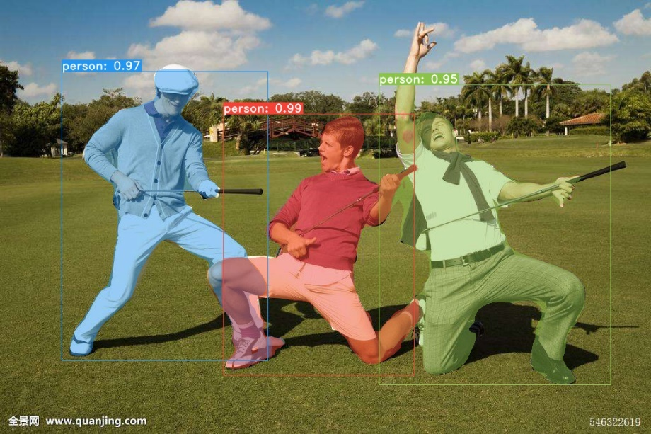
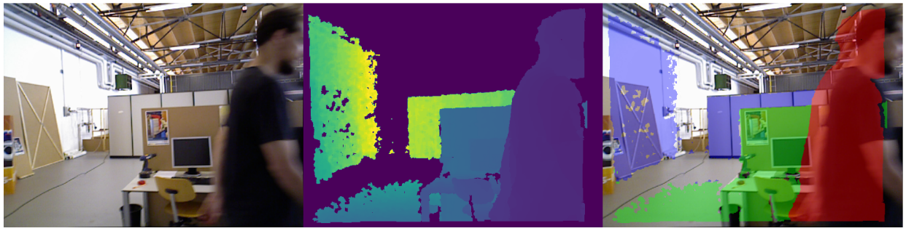
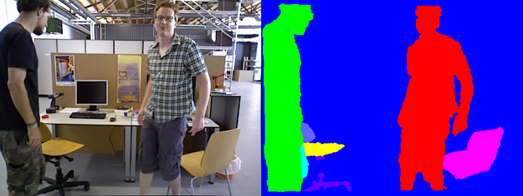
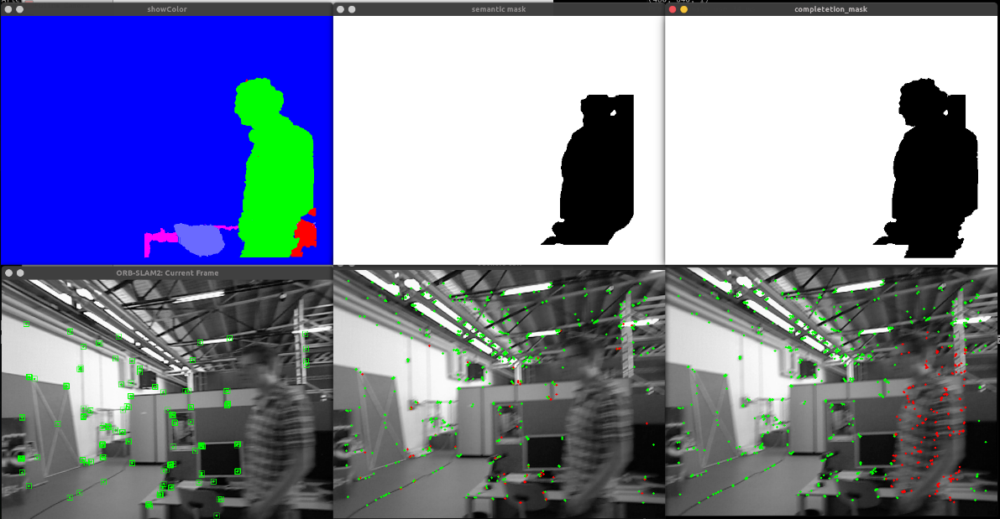
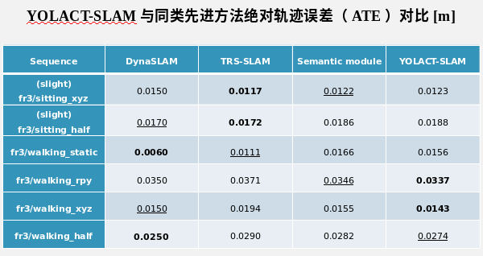
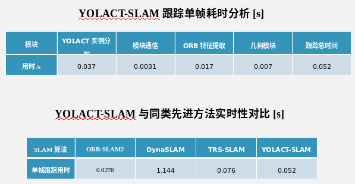

# dyslam

Dyslam is written based on [ORB-SLAM2](https://github.com/raulmur/ORB_SLAM2), [yolact_edge](https://github.com/haotian-liu/yolact_edge) and [Dynamic-ORB-SLAM2](https://github.com/guanfang12/Dynamic_ORB_SLAM2). All programs are deployed under the ROS system. The slam module communicates with the semantic segmentation module through the service, which means that you can modify the model used by the semantic module at will or directly discard the semantic module.

It can **identify and deal with dynamic objects** for monocular, stereo and RGB-D configurations. More specificly, the Yolct_ddge is applied to extract dynamic objects from input frame, and region grow algorithm will be used to complete mask. Then a mask is applied to feature extractor to remove dynamic keypoints in each level of image pyramid.

This paper proposes a real-time semantic RGB-D slam system for dynamic environments, which can detect known and unknown moving objects.

## Features

1.This paper uses instance segmentation network named YOLACT_edge, uses TensorRT technology to compress, and optimize the network, and successfully realizes the processing speed of 27fps on the 1050ti computing platform. 

2.This paper proposes an effective geometric module, which divides the depth image into a few regions by using the region growth segmentation algorithm. The module can effectively improve the problem of incomplete mask coverage, eliminate the errors caused by the inconsistent sampling time of visual image and depth image in RGB-D camera, and identify the dynamic regions via their reprojection errors. 

3.This paper adds the semantic information and region segmentation mask into the VSLAM system to screen the dynamic features in real time, and establishes the yolact-slam. The algorithm achieves the real-time effect of 18fps on 1050Ti. In the dynamic scene sequence of the data set TUM-RGBD, the absolute trajectory errors of the system are far lower than those of the general VSLAM system (ORB-SLAM2), and the RMSE is within 3.5cm. 

## Getting Started

- Install ORB-SLAM2 prerequisites: C++11 or C++0x Compiler, Pangolin, OpenCV and Eigen3 (https://github.com/raulmur/ORB_SLAM2).
- Install Yolact prerequisites:   DCNv2

~~~bash
cd src/yolact_ros/scripts/yolact/external/DCNv2-1.4
python setup.py build develop
~~~

- Install Yolact_edge prerequisites: python3, Pytorch, TensorRT (https://github.com/haotian-liu/yolact_edge/blob/master/INSTALL.md).
- Download net weights to  /src/yolact_ros/scripts/faster_yolact/weights. (https://github.com/haotian-liu/yolact_edge)
  - yolact_edge_54_800000.pth
  - yolact_edge_mobilenetv2_54_800000.pth
  - yolact_edge_resnet50_54_800000.pth
  - yolact_edge_vid_resnet50_847_50000.pth

- Compiling ROS workspace (Note, the parameters after -DPYTHON_EXECUTABLE should be the path of python3 which you installed pytorch)

~~~bash
catkin_make -DPYTHON_EXECUTABLE=/usr/bin/python3
~~~

- Download 

## Running

~~~
source devel/setup.bash 
roscore
rosrun yolact_ros fast_server.py  # another terminal
roslaunch dynamic_orb_slam2 orb_slam2.launch  # another terminal
~~~

